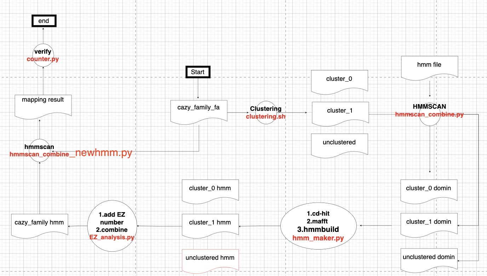

## Build new HMM based eCAMI 06/12/2021

### Flowchart of building process


### How to start:
* Step1: Please analyze `cazy_family_EC.csv` and `cazysubfamily_EC.csv` first. If the family hmm is correct, then keep the family hmm. Otherwise, please discuss it with Dr.Yin.
* Step2: Git clone the repo to your environment
* Step3: Download `original hmm files` to your environment, and the folder should be called `ori_hmm_refe_combine`. Please ask Dr.Yin to get the original hmm files.
* Step4: Move `examples/clustering/output/dbCAN3_new` and `examples/clustering/output/dbCAN3` from `smallprotein/eCAMI`to your environment.
* Step5: Read follows.

### Building method
* step0: please read the instroduction of eCAMI first.
* step1: create a python execution environment based on the Introduction of eCAMI. The ouput will be in `examples/clustering/output/dbCAN3_new`. Please copy all of them into `examples/clustering/output/dbCAN3` by using this command `cp -rfp * ../dbCAN3/`
* step2: cluster CAZy families, please specify the CAZy family name in clustering.sh.
`. clustering.sh`
* step3: build new HMM, please specify the CAZy family name in hmm_analysis.sh.
`. hmm_analysis.sh`

### Introduction of exe files 
* clustering.sh: a shell script to run `clustering.py` by specifying a specific CAZy family.
* hmm_analysis.sh: a shell script to run a combination python files about building HMM.
* hmmscan_combine.py: a python script to run hmmscan based on combined hmm files.
* hmmscan_nocombine.py: a python script to run hmmscan based on no combined hmm files.
* hmmscan-parser.sh: a shell script to parse the result of hmmscan.
* hmm_maker.py: a python script to run hmmbuild.
* EZ_analysis.py: a python script to add EC number into HMM.
* counter.py: a python script to create two excels. One excel is `cazyfamily,# of proteins,# of eCAMI subfams (exclude unclassified),# of proteins in subfams,# of subfams with EC, # of proteins in subfams with EC`. Another one is `CAZy subfam,# of proteins,# of proteins with EC,after hmmsearch # of remaining proteins,after hmmsearch # of remaining protein domains,after the usearch # of remaining proteins for mafft`

### Output Path
* The output of `clustering.sh` is `examples/clustering/output/dbCAN3_new/`. Please copy all of them into `examples/clustering/output/dbCAN3` by using this command `cp -rfp * ../dbCAN3/`.
* The output of `hmmscan_combine.py` is `hmm_analysis_combinded/cut_domain_seq`.
* The output of `hmm_maker.py` is `hmm_analysis_combinded/hmm`.
* The output of `EZ_analysis.py` is `hmm_refe_combine`.
* The output of `hmmscan_combine.py` is `hmm_analysis_combinded/seq_summary`.
* The output of `counter.py` is `cazy_family_EC.csv` and `cazysubfamily_EC.csv`.

## eCAMI: Simultaneous Classification and Motif Identification for enzyme/CAZyme annotation<br>
### Running Environment<br>
* Linux environment, Python 3<br>
* The three packages need to be available: psutil, collections, scipy, numpy<br>
* The two python scripts (clustering.py and prediction.py) need to be in the same folder<br>
* the fasta file must follow this format:
```
>unique_sequence_ID followed by a “|” 
```
### Install<br>
```
git clone https://github.com/zhanglabNKU/eCAMI.git
cd eCAMI/

* install required python packages
pip install scipy
pip install argparse
pip install psutil
pip install numpy

```
### Prediction: 
given new protein sequences, search against a pre-computed k-mer peptide library, which are associated with known CAZyme families or EC numbers, for CAZyme family or EC number assignments<br>
* First, two pre-computed k-mer peptide libraries come with this package (the CAZyme and EC folder) and must exist in your folder<br>
* The prediction.py can be run as follows:<br>
```
python prediction.py -input <file_name> -kmer_db <kmer_dir_path> -output <prediction_output_name>
```
For example:
```
python prediction.py -input examples/prediction/input/test.faa -kmer_db CAZyme -output examples/prediction/output/new-output.txt
```
> The test.faa in the `examples/prediction/input` folder will be processed by comparing to the pre-computed k_mer peptides (the k_mer library) in the `CAZyme` folder. You will get the prediction results named `new-output.txt` in the `examples/prediction/output` folder. You can compare it with the `test_pred_cluster_labels.txt` that is already there.<br>
* In addition, other options for prediction are also available:<br>
  * `-k_mer`: the length of the k_mer peptide to be extracted from the query for comparison against the k_mer peptide library; the length must be the same as the length of the k_mers in the k_mer peptide library (default=8) <br>
  * `-jobs`: the number of CPU processors to use (default=8) <br>
  * `-beta`: the minimum sum of k_mer frequency for assigning the query to an existing protein family of the k_mer peptide library (default=1) <br>
  * `-important_k_mer_number`: the minimum number of the same k_mers shared between the query and a family in the k_mer peptide library (default=3)  <br>

* In most of times, only option `-k_mer` is needed to change<br>
* To print all options, you can type:<br>
```
python prediction.py -help
```
* Output files: please see the readme.txt file in the examples/prediction folder for explaination of the output files and format. <br>

* Briefly, the output.txt will have the assignment of the query to the existing protein family of the k_mer peptide library, e.g.,:<br>
```
protein_name    fam_name:group_number    subfam_name_of_the_group:subfam_name_count
matching kmers(start position in the query sequence)
For example:
>AIJ19564.1|GH5_4|3.2.1.4	GH5:102	GH5_4:15|3.2.1.4:3
SVRIPVTW(82),RIPVTWMG(84),PVTWMGHI(86),VTWMGHIG(87),IINIHHDG(124),VLNEWNQV(210),NRLMVAVH(259),
```

### Clustering: 
given a fasta file of a protein family, e.g., CAZyme family or EC at the 3rd level or any protein family, classify the sequences into clusters and extract the distinguishing k-mer peptides of each cluster (i.e., build your own library of k-mer peptides for future use) <br>
* The clustering.py can be run as follows:<br>
```
python clustering.py -input <file_name> -output_dir <output_dir_name>
```
For example:
```
python clustering.py -input examples/clustering/input/GH5.faa -output_dir examples/clustering/output/new-GH5
python clustering.py -input examples/clustering/input/3.2.1.-.faa -output_dir examples/clustering/output/new-EC3.2.1.-
```
> The `GH5.faa` in the `examples/clustering/input` folder will be processed. You will get the clustering results (fasta seqs and distinguising k-mer peptides of each cluster) in the `examples/clustering/output/new-GH5` folder.<br>
> The `3.2.1.-.faa` in the `examples/clustering/input` folder will be processed. You will get the clustering results (fasta seqs and distinguising k-mer peptides of each cluster) in the `examples/clustering/output/new-EC3.2.1.-` folder.<br>
> You can compare them with the `GH5` and the `EC3.2.1.-` folders that are already there.

* In addition, other options for clustering are also available:<br>
  * `-k_mer`: the length of the k-mer peptide for clustering (default=8) <br>
  * `-minimum_group_size`: the minimum number of proteins the final cluster (default=5)<br>
  * `-piece_number`: the number of spliting pieces of sorted peptides (default=8)<br>
  * `-jobs`: the number of CPU processors to use (default=1) <br>
  * `-important_k_mer_number`: the minimum number of k_mer for making groups/clusters in the first step (default=10) <br>
  * `-alpha`: the minimum sum of k_mer frequency for combining groups (default=7) <br>
  * `-beta`: the minimum sum of k_mer frequency for adding singletons into existing groups (default=1) <br>
  * `-del_percent`: the minimum percentage a k_mer's frequency in a cluster divided by its frequency in the whole protein set to be considered for clustering (default=0.2) <br>
  * `-selected_k_mer_number_cut`: the minimum number of proteins that a k_mer is present to remove before clustering (default=2) <br><br>
* In most of times, only options `-k_mer`, `-minimum_group_size` and `-jobs` are needed to change<br>
* To print all options, you can type:<br>
```
python clustering.py -help
```
* Output files: please see the readme.txt file in the examples/clustering folder for explanation of the output files and format. <br><br><br>


